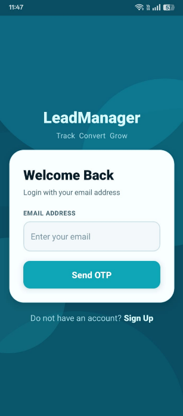
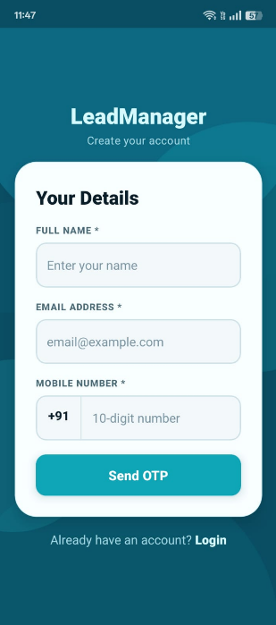
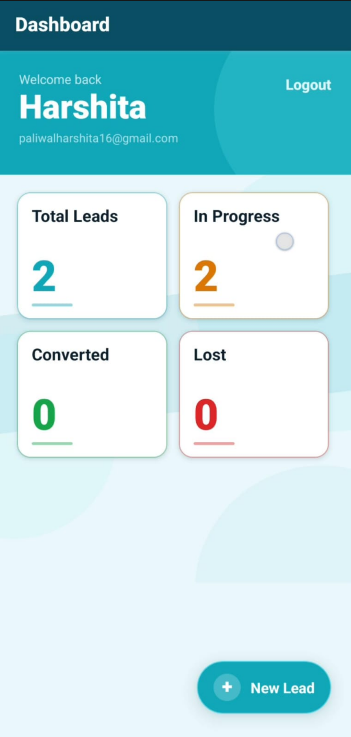
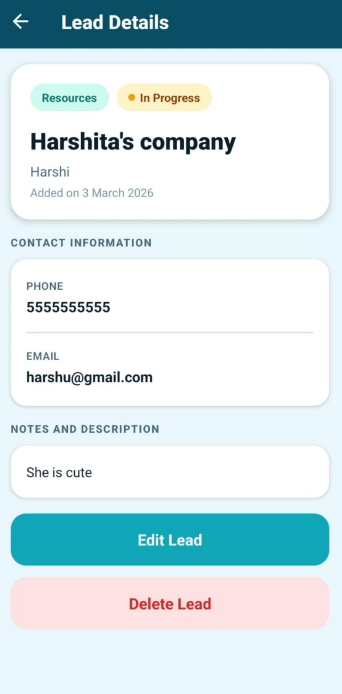

# 📱 Lead Management App

React Native + Node.js + Express + MySQL  
**Auth: Email OTP via Nodemailer (Gmail SMTP)**

This application enables startups to efficiently manage customer leads by allowing users to create, track, and update leads while also viewing leads generated by other users in the system and identifying the lead creator.

---

# 🛠 Tech Stack

### Frontend
- React Native
- React Navigation
- Context API

### Backend
- Node.js
- Express.js
- JWT Authentication

### Database
- MySQL

---

# ✨ Features

- User Authentication using Email OTP
- Create new leads
- View all leads
- Search and filter leads
- Lead details page
- Update lead information
- Delete leads
- Dashboard with lead statistics
- Secure REST APIs with JWT authentication

---
# 📸 Screenshots

### Login Screen
 

### Signup Screen


### Dashboard


### Leads List


### Lead Detail


---
# 🚀 Installation & Setup

### 1 Clone Repository

```bash
git clone https://github.com/Harshita-Paliwal/lead-management.git

### . Database
```bash
mysql -u root -p < database/schema.sql
```

### 2. Backend
```bash
cd backend
npm install
# Fill in .env (see below)
npm run dev
```

### 3. Gmail App Password (for OTP emails)
1. Go to your Google Account → Security
2. Enable **2-Step Verification**
3. Go to **App Passwords** → Generate one for "Mail"
4. Paste it as `MAIL_PASS` in `.env`

### 4. .env file
```env
PORT=5000
DB_HOST=localhost
DB_USER=root
DB_PASSWORD=your_mysql_password
DB_NAME=lead_management
JWT_SECRET=any_long_secret_string
JWT_EXPIRES_IN=7d
MAIL_HOST=smtp.gmail.com
MAIL_PORT=587
MAIL_USER=your_gmail@gmail.com
MAIL_PASS=your_app_password_here
MAIL_FROM="LeadManager <your_gmail@gmail.com>"
```

### 5. Frontend
```bash
cd frontend
npm install
# Android emulator:
npx react-native run-android
# Physical device: update BASE_URL in src/services/api.js to your machine's local IP
```

---

## 🌐 API Endpoints

### Auth
| Method | Endpoint | Body | Description |
|--------|----------|------|-------------|
| POST | `/api/auth/signup` | `{username, email, mobile}` | Register & send OTP to email |
| POST | `/api/auth/verify-signup` | `{email, otp}` | Verify OTP → create account |
| POST | `/api/auth/send-otp` | `{email}` | Login → send OTP to email |
| POST | `/api/auth/verify-otp` | `{email, otp}` | Verify OTP → JWT token |

### Leads (Bearer Token required)
| Method | Endpoint | Description |
|--------|----------|-------------|
| GET | `/api/leads/stats` | Dashboard stats |
| GET | `/api/leads` | All leads (`?status=&type=&search=`) |
| GET | `/api/leads/:id` | Single lead |
| POST | `/api/leads` | Create lead |
| PUT | `/api/leads/:id` | Update lead |
| DELETE | `/api/leads/:id` | Delete lead |

---

##📱 App Screens
1️⃣ Login Screen
Enter email → receive OTP → verify login
2️⃣ Signup Screen
Name + Email + Mobile → verify OTP → account created
3️⃣ Dashboard
Displays statistics with clickable cards
4️⃣ Leads List
Search and filter leads by status or type
5️⃣ Lead Detail Screen
View full lead information with edit and delete options
6️⃣ Lead Form Screen
Create new leads or update existing ones
